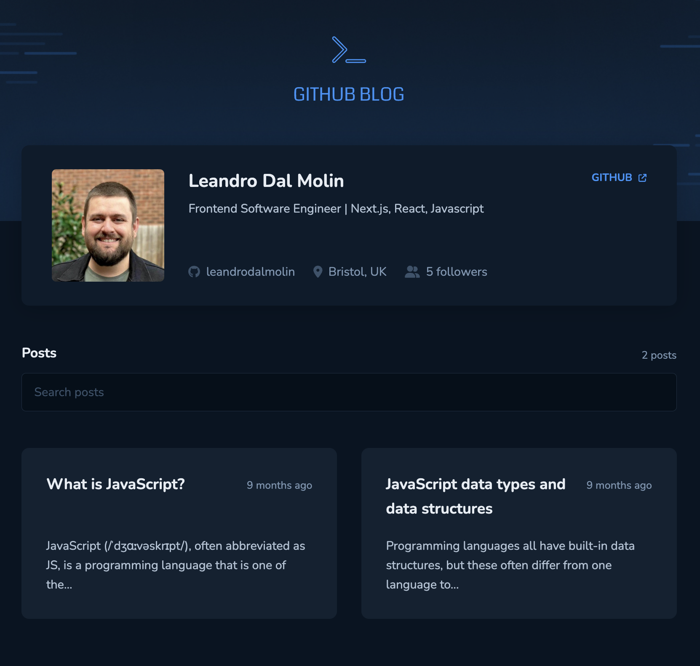

# Coffee Delivery app

## Table of contents

- [The project](#the-project)
- [Screenshot](#screenshot)
- [Links](#links)
- [Built with](#built-with)
- [Project setup](#project-setup)

## The project

An application that uses the GitHub API to facilitate the search and display of repository issues in a blog-like format. The key functionalities include:

- Quick overview of the user's profile, incorporating details such as image, follower count, name, and additional information accessible via the GitHub Users API
- List of repository posts (issues) with a small summary of their content
- Filter posts (issues) using the GitHub Search API
- A single page for each post (issue)

Covered concepts:

- Rest API
- Caching
- Routing
- Forms

## Screenshot



## Links

- Live demo: [https://rct-github-blog.vercel.app/](https://rct-github-blog.vercel.app/)

## Built with

- Vite
- ReactJS
- TypeScript
- React Router
- Styled-components
- React Markdown
- TanStack React Query
- Axios

## Project setup

```
npm install
```

### Start dev server

```
npm run dev
```

### Build for production

```
npm run build
```

### Locally preview production build

```
npm run preview
```

### Lint files

```
npm run lint
```
